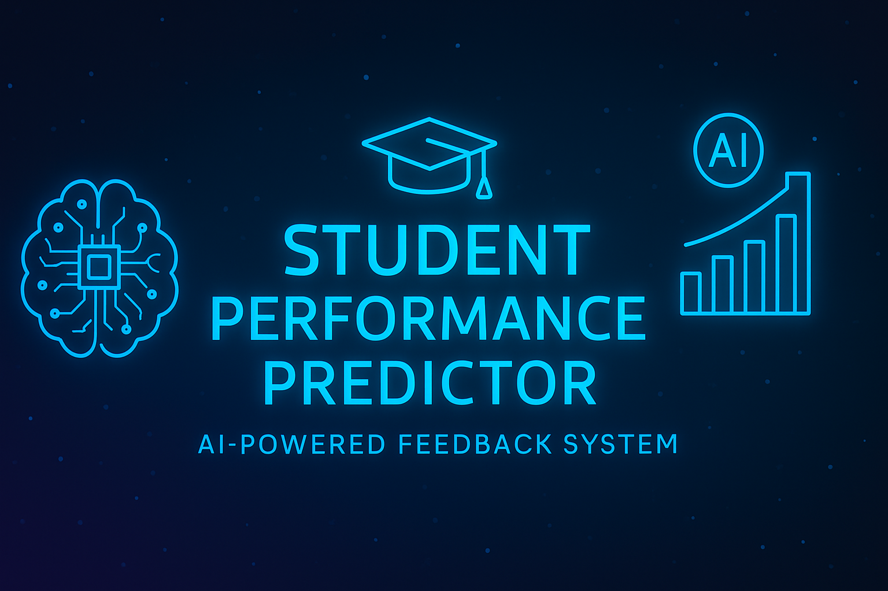

[](https://www.python.org/)
[](https://fastapi.tiangolo.com/)
[](https://react.dev/)
[](LICENSE)
[](https://www.docker.com/)

<p align="center">
  
</p>

# 🎓 Student Performance Predictor  
> An AI-powered full-stack web application that predicts student performance and provides smart, personalized feedback to help improve learning outcomes.

---

## 🌐 Live Demo  
[🔗 Visit Live Project](https://student-performance-predictor-brown.vercel.app)

---

## 🧠 Overview  
This project is a **Full Stack AI-Powered Feedback System** that predicts whether a student will pass or fail based on key academic features such as attendance, marks, and internal scores.  
It also generates **personalized learning feedback** using a trained ML model and adaptive logic.

---

## ⚙️ Tech Stack  

### 🖥️ Frontend  
- React 18  
- TypeScript + Vite  
- Tailwind CSS  
- Axios  

### ⚙️ Backend  
- Python 3.10+  
- FastAPI  
- SQLAlchemy  
- Scikit-learn  
- Joblib  

### 🗄️ Database  
- SQLite (default)  
- Easily switchable to PostgreSQL/MySQL  

### 🧩 Others  
- Docker & Docker Compose  
- Virtual Environment (venv)  
- RESTful API Architecture  

---

## 🧱 Project Architecture  

```
Student_Performance_Predictor/
│
├── backend/
│   ├── app/
│   │   ├── main.py              # FastAPI entry point
│   │   ├── database.py          # DB connection setup
│   │   ├── models.py            # SQLAlchemy ORM models
│   │   ├── schemas.py           # Pydantic schemas
│   │   ├── crud.py              # CRUD operations
│   │   └── ml/
│   │       ├── train.py         # Model training
│   │       └── predictor.py     # Model prediction
│   ├── scripts/
│   │   └── import_csv.py        # Import student data
│   ├── requirements.txt
│   └── Dockerfile
│
├── frontend/
│   ├── src/
│   │   ├── pages/               # UI pages (Predictor, Students, Admin)
│   │   ├── api.ts               # API integration
│   │   ├── App.tsx / main.tsx
│   ├── package.json
│   ├── vite.config.ts
│   └── Dockerfile
│
├── data/
│   └── student_data_sample.csv
│
├── scripts/
│   ├── dev.sh / dev.ps1         # Dev environment scripts
│
├── docker-compose.yml
├── Makefile
└── README.md
```

---

## 🚀 How to Run  

### 🔹 Option 1: Using Docker (Recommended)
```bash
# Build and start all services
docker-compose up --build
```

**Access:**
- Frontend → [http://localhost:5173](http://localhost:5173)  
- Backend API → [http://localhost:8000](http://localhost:8000)  
- Docs → [http://localhost:8000/docs](http://localhost:8000/docs)

---

### 🔹 Option 2: Manual Setup (Local Development)

#### 🧩 Backend
```bash
cd backend
python -m venv venv
.\venv\Scripts\activate  # (Windows)
pip install -r requirements.txt
uvicorn app.main:app --reload
```

#### 💻 Frontend
```bash
cd frontend
npm install
npm run dev
```

---

## 🧮 Machine Learning Model  

| Feature | Description |
|----------|--------------|
| **Algorithm** | Logistic Regression |
| **Library** | scikit-learn |
| **Input Features** | attendance, marks, internal_score |
| **Target Variable** | result (1 = pass, 0 = fail) |
| **Training Split** | 80/20 |
| **Model Storage** | joblib |

---

## 🧾 API Endpoints  

| Method | Endpoint | Description |
|---------|-----------|-------------|
| GET | `/health` | Health check |
| POST | `/api/predict` | Predict single student |
| POST | `/api/retrain` | Retrain ML model (admin only) |
| GET | `/api/students` | Get student list |
| POST | `/api/students` | Add new student |
| DELETE | `/api/students/{id}` | Delete student |
| POST | `/api/export` | Export data as CSV |

---

## 🧰 Environment Variables  

**Backend (`.env`):**
```ini
ADMIN_TOKEN=changeme
DATABASE_URL=sqlite:///./db.sqlite
MODEL_PATH=./models/marks_classifier.joblib
MODEL_METADATA_PATH=./models/metadata.json
PRED_THRESHOLD=0.6
```

**Frontend (`.env`):**
```ini
VITE_API_BASE_URL=http://localhost:8000
```

---

## 📊 Example Prediction  

**Request:**
```bash
curl -X POST "http://localhost:8000/api/predict" \
  -H "Content-Type: application/json" \
  -d '{"attendance": 82, "marks": 75, "internal_score": 20}'
```

**Response:**
```json
{
  "predicted_result": 1,
  "probability": 0.85
}
```

---

## 💡 Key Features  

✅ Predict pass/fail probability  
✅ Retrain ML model dynamically  
✅ Manage students & data via UI  
✅ Personalized improvement feedback  
✅ FastAPI Swagger API docs  
✅ Docker-based deployment  

---

## 🧠 Future Enhancements  

- 🧾 Integration with PostgreSQL for scalability  
- 📊 Add SHAP-based explainability  
- 🔄 Scheduled retraining jobs  
- 📈 Dashboard analytics for admin view  

---

## 🤝 Contributing  

Want to improve this project?  
1. Fork the repo  
2. Create a new branch (`feature/new-feature`)  
3. Commit your changes  
4. Open a Pull Request  

---

## 📜 License  

This project is licensed under the **MIT License** — free to use and modify for educational purposes.

---

## 💬 Author  

👨‍💻 **Ayush Raj**  
📍 VIT Vellore | Data Science | AI & Management Enthusiast  
🔗 [GitHub Profile](https://github.com/Programmer-Ayush-Raj)  
📧 rajayush6200@gmail.com  

---

⭐ **If you like this project, give it a star!**  
Your support motivates continued development 🚀
